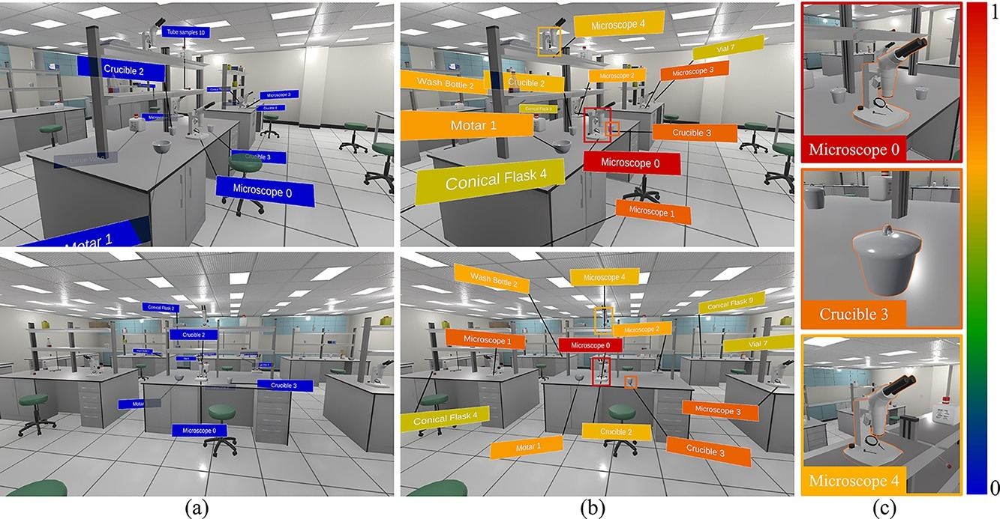
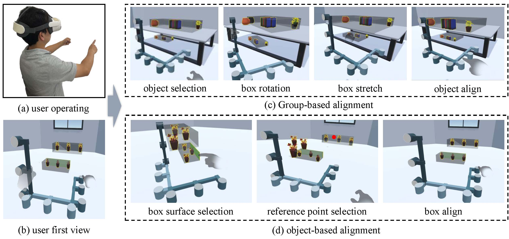
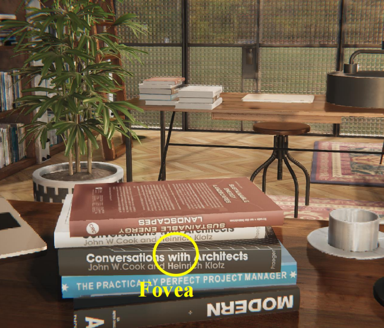

<!-- publications.qmd -->

---
title: "Publications"
description-meta: "Information, PDFs, and social metrics of papers"
#page-layout: full
#back-to-top-navigation: true
title-block-banner: false
css: custom.css
---

`*` indicates corresponding author.

## 2026

**Jian Wu**, Shuai Luan, Dong Zhou, Wei Ke, Lili Wang\*. 2026. **User perception based label layout for efficient target localization in virtual environment**. *International Journal of Human-Computer Studies*, Volume 211, April 2026, 103801. full-text [pdf](assets/papers/2026-user-perception-label-layout.pdf)

**Jian Wu**, Ziteng Wang, Runze Fan, Qixiang Ma, Lizhi Zhao, Xuehuai Shi, Lili Wang\*. **Align-Box: Enable Fast Bare-Hand Multi-Object Alignment in VR**. *International Journal of Human-Computer Interaction*. full-text [pdf](assets/papers/align-box.pdf)

**Jian Wu**, Lili Wang\*, Zhikai Wen, Yanzhou Chen, Qianwen Wang, Bin Hu, Xuehuai Shi, Xiaolong Liu. **Automatic Formation Generation based on Scene Awareness for Guided Group Navigation in VR**. *IEEE Transactions on Visualization and Computer Graphics (IEEE TVCG)*. full-text [pdf](assets/papers/automatic-formation-generation-scene-awareness.pdf)

Runze Fan, **Jian Wu**, Qixiang Ma, Zhikai Wen, Lili Wang\*. **Motion Hierarchical Gaussian for Dynamic Control in VR**. *IEEE Transactions on Visualization and Computer Graphics (IEEE TVCG)*. Also presented at *IEEE VR*. full-text [pdf](assets/papers/motion-hierarchical-gaussian.pdf)

Lili Wang, Weiwei Xu, Yebin Liu, Miao Wang, Beibei Wang, Xubo Yang, Lan Xu, Zhangyao Tan, Runze Fan, Zijun Wang, Chi Wang, Hongwen Zhang, Yijian Wen, Haozhong Yang, **Jian Wu\***, Jiahui Fan, Hui Wang, Qixuan Zhang, Guoping Wang, Yongtian Wang, Qinping Zhao. **Artificial intelligence for virtual reality: a review**. *Science China Information Sciences*, 69(1), 1-64. full-text [pdf](assets/papers/artificial-intelligence-for-virtual-reality-review.pdf)

## 2025

Xuehuai Shi, Yuhan Duan, Ziteng Wang\*, **Jian Wu\***, Zhiwen Shao, Jieming Yin, Lili Wang. 2025. **MOA: Efficient Scene-aware Multi-object Arrangement in VR**. *IEEE Transactions on Visualization and Computer Graphics (IEEE TVCG)*. full-text [pdf](assets/papers/2025-moa-efficient-scene-aware-multi-object-arrangement.pdf)

Qixiang Ma, Runze Fan, Lizhi Zhao, **Jian Wu**, Sio-Kei Im, Lili Wang\*. 2025. **SGSG: Stroke-Guided Scene Graph Generation**. *IEEE Transactions on Visualization and Computer Graphics (IEEE TVCG)*. Also presented at *IEEE ISMAR*. full-text [pdf](assets/papers/2025-sgsg-stroke-guided-scene-graph-generation.pdf)

Kangyu Wang, **Jian Wu**, Runze Fan, Hongwen Zhang, Sio Kei Im, Lili Wang\*. **HFM-GS: half-face mapping 3DGS avatar based real-time HMD removal**. *IEEE Transactions on Visualization and Computer Graphics (IEEE TVCG)*. Also presented at *IEEE ISMAR*. full-text [pdf](assets/papers/hfm-gs-half-face-mapping-3dgs-avatar.pdf)

Peike Wang, Ming Li, **Jian Wu**, Lili Wang\*, Yong-Jin Liu. **Cybersickness Exploration for Different VR Tasks Under Variable Rendering Conditions**. *International Journal of Human-Computer Interaction (IJHCI)*. full-text [pdf](assets/papers/cybersickness-exploration-vr-tasks.pdf)

Sichun Huang, **Jian Wu**, Runze Fan, Sio Kei Im, Lili Wang\*. **HandBrush for Efficient Object Grouping in Virtual Environment with Bare-Hand**. *International Journal of Human-Computer Interaction (IJHCI)*, 41(15), 9797-9821. full-text [pdf](assets/papers/handbrush-efficient-object-grouping.pdf)

Jiaye Leng, Zijun Wang, **Jian Wu\***, Lili Wang. **LipText: Lip Tracking Based Text Entry in VR**. *International Conference on Extended Reality (ICXR)*, 162-178. full-text [pdf](assets/papers/liptext-lip-tracking-text-entry-vr.pdf)

Xuehuai Shi, Yucheng Li, Jiaheng Li\*, **Jian Wu**, Jieming Yin\*, Xiaobai Chen, Lili Wang. **Audio-visual aware Foveated Rendering**. *IEEE Transactions on Visualization and Computer Graphics (IEEE TVCG)*. full-text [pdf](assets/papers/audio-visual-aware-foveated-rendering.pdf)

Runze Fan, **Jian Wu**, Xuehuai Shi, Lizhi Zhao, Qixiang Ma, Lili Wang\*. 2025. **Fov-GS: Foveated 3D Gaussian Splatting for Dynamic Scenes**. *IEEE Transactions on Visualization and Computer Graphics (IEEE TVCG)*, 31(5), 2975-2985. Also presented at *IEEE VR*. VR 2025 Best Paper Honorable Mention. full-text [pdf](assets/papers/2025-fov-gs-foveated-3d-gaussian-splatting.pdf)

**Jian Wu**, Weicheng Zhang, Handong Chen, Wei Lin, Xuehuai Shi, Lili Wang\*. 2025. **PwP: Permutating with Probability for Efficient Group Selection in VR**. *IEEE Transactions on Visualization and Computer Graphics (IEEE TVCG)*, 31(5), 2384-2394. Also presented at *IEEE VR*. full-text [pdf](assets/papers/2025-pwp-permutating-with-probability.pdf)

## 2024

Qixiang Ma, **Jian Wu**\*, Runze Fan, Guodong Sun, Xuehuai Shi. **ViP-Fluid: Visual Perception Driven Method for VR Fluid Rendering**. *2024 IEEE International Symposium on Mixed and Augmented Reality (ISMAR)*, Bellevue, WA, USA, 2024, pp. 359-367. full-text [pdf](assets/papers/Vip-Fluid.pdf)

Jiaqi Zhou, **Jian Wu**, Sio Kei Im, Runze Fan, Lili Wang\*. **Manipulable Cone Based Bare Hand Object Selection in High Occlusion Virtual Environment**. *International Journal of Human-Computer Studies (IJHCS)*, 196, 103432. full-text [pdf](assets/papers/manipulable-cone-bare-hand-selection.pdf)

Lili Wang\*, Xiangyu Li, **Jian Wu**, Dong Zhou, Im Sio Kei, Voicu Popescu. **AVICol: Adaptive Visual Instruction for Remote Collaboration Using Mixed Reality**. *International Journal of Human-Computer Interaction (IJHCI)*, 41(2), 1260-1279. full-text [pdf](assets/papers/avicol-adaptive-visual-instruction.pdf)

Aoxin Sun, **Jian Wu**, Runze Fan, Sio Kei Im, Lili Wang\*. **Efficient and Comfortable Haptic Retargeting with Reset Point Optimization**. *IEEE Transactions on Visualization and Computer Graphics (IEEE TVCG)*. full-text [pdf](assets/papers/efficient-comfortable-haptic-retargeting-reset-point.pdf)

Xinda Liu\*, Kun Jiang, **Jian Wu**, Lili Wang, Guohua Geng. **Where Should a Virtual Guide Stand in a VR Museum?** *International Conference on Extended Reality (ICXR)*, 312-328. full-text [pdf](assets/papers/where-should-a-virtual-guide-stand.pdf)

Zijun Wang, **Jian Wu**, Runze Fan, Wei Ke, Lili Wang\*. **VPRF: Visual Perceptual Radiance Fields for Foveated Image Synthesis**. *IEEE Transactions on Visualization and Computer Graphics (IEEE TVCG)*, 30(11), 7183-7192. Also presented at *IEEE ISMAR*. ISMAR 2024 Best Student Journal Paper. full-text [pdf](assets/papers/vprf-visual-perceptual-radiance-fields.pdf)

Xuehuai Shi, Lili Wang\*, Xinda Liu, **Jian Wu**, Zhiwen Shao. **Scene-aware Foveated Neural Radiance Fields**. *IEEE Transactions on Visualization and Computer Graphics (IEEE TVCG)*. full-text [pdf](assets/papers/scene-aware-foveated-neural-radiance-fields.pdf)

**Jian Wu**, Lili Wang\*, Sio Kei Im, Chan Tong Lam. **EEBA: Efficient and ergonomic Big-Arm for distant object manipulation in VR**. *International Journal of Human-Computer Studies (IJHCS)*, 188, 103273. full-text [pdf](assets/papers/eeba-efficient-ergonomic-big-arm.pdf)

Ziming Liu, **Jian Wu**, Lili Wang\*, Xiangyu Li, Sio Kei Im. **Proxy Importance Based Haptic Retargeting With Multiple Props in VR**. *IEEE Transactions on Visualization and Computer Graphics (IEEE TVCG)*. full-text [pdf](assets/papers/proxy-importance-haptic-retargeting-multiple-props.pdf)

**Jian Wu**, Ziteng Wang, Lili Wang\*, Yuhan Duan, Jiaheng Li. **FanPad: A Fan Layout Touchpad Keyboard for Text Entry in VR**. *IEEE Conference on Virtual Reality and 3D User Interfaces (IEEE VR)*, 222-232. full-text [pdf](assets/papers/fanpad-fan-layout-touchpad-keyboard.pdf)

Xiaolong Liu, Lili Wang\*, Yi Liu, **Jian Wu**. **Automatic portals layout for VR navigation**. *Virtual Reality*, 28(1), 9. full-text [pdf](assets/papers/automatic-portals-layout-vr-navigation.pdf)

**Jian Wu**, Lili Wang\*. **Panoramic Ray Tracing for Interactive Mixed Reality Rendering Based on 360 RGBD Video**. *IEEE Computer Graphics and Applications (IEEE CG&A)*. full-text [pdf](assets/papers/panoramic-ray-tracing-interactive-mr.pdf)

## Before 2024

**Jian Wu**, Lili Wang\*, Wei Ke. **Interactive Panoramic Ray Tracing for Mixed 360 RGBD Videos**. *IEEE VRW*, 777-778. full-text [pdf](assets/papers/interactive-panoramic-ray-tracing-mixed-rgbd.pdf)

Xuehuai Shi, Lili Wang\*, **Jian Wu**, Wei Ke, Chan-Tong Lam. **Locomotion-aware Foveated Rendering**. *IEEE VR*, 471-481. full-text [pdf](assets/papers/locomotion-aware-foveated-rendering.pdf)

Zixiang Zhao, **Jian Wu**, Lili Wang\*. **AR assistance for efficient dynamic target search**. *Computational Visual Media (CVM)*, 9(1), 177-194. full-text [pdf](assets/papers/ar-assistance-efficient-dynamic-target-search.pdf)

Xuehuai Shi, Lili Wang\*, **Jian Wu**, Aimin Hao. 2022. **Foveated Stochastic Lightcuts**. *IEEE Transactions on Visualization and Computer Graphics*, 28(11), 3684-3693. full-text [pdf](assets/papers/2022-foveated-stochastic-lightcuts.pdf)

Lili Wang\*, Yi Liu, Xiaolong Liu, **Jian Wu**. 2021. **Automatic Virtual Portals Placement for Efficient VR Navigation**. *IEEE VR 2021 Poster*, 628-629. full-text [pdf](assets/papers/2021-automatic-virtual-portals-placement.pdf)

**Jian Wu**, Lili Wang\*, Hui Zhang, Voicu Popescu. 2022. **Quantifiable Fine-Grain Occlusion Removal Assistance for Efficient VR Exploration**. *IEEE Transactions on Visualization and Computer Graphics*, 28(9), 3154-3167. full-text [pdf](assets/papers/2022-quantifiable-fine-grain-occlusion-removal.pdf)

Lili Wang\*, **Jian Wu**, Xuefeng Yang, Voicu Popescu. 2019. **VR Exploration Assistance through Automatic Occlusion Removal**. *IEEE Transactions on Visualization and Computer Graphics*, 25(5), 2083-2092. Also presented at *IEEE VR 2019*. full-text [pdf](assets/papers/2019-vr-exploration-assistance-occlusion-removal.pdf)

Lili Wang\*, Han Zhao, Zesheng Wang, **Jian Wu**, Bingqiang Li, Zhiming He, Voicu Popescu. 2019. **Occlusion management in VR: A comparative study**. *IEEE VR 2019*, 708-716. full-text [pdf](assets/papers/2019-occlusion-management-comparative-study.pdf)

<!--::: {.pub-card}
{.pub-thumb}

User perception based label layout for efficient target localization in virtual environment

<strong>Jian Wu</strong>, Shuai Luan, Dong Zhou, Wei Ke, Lili Wang 
International Journal of Human-Computer Studies, Volume 211, April 2026, 103801

<a href="assets/papers/2026-user-perception-label-layout.pdf" target="_blank">PDF</a>

:::

---
title: "Publications"
---

# Publications

`*` indicates corresponding author.

::: {.pub-card}
{.pub-thumb}

::: 

User perception based label layout for efficient target localization in virtual environment

<strong>Jian Wu</strong>, Shuai Luan, Dong Zhou, Wei Ke, Lili Wang International Journal of Human-Computer Studies, Volume 211, April 2026, 103801

<a href="assets/papers/user-perception-label-layout.pdf" target="_blank">PDF</a>
<a href="assets/videos/user-perception-label-layout.mp4" target="_blank">Video</a>

:::
:::

::: {.pub-card}
{.pub-thumb}

::: 

Align-Box: Enable Fast Bare-Hand Multi-Object Alignment in VR

<strong>Jian Wu</strong>, Ziteng Wang, Runze Fan, Qixiang Ma, Lizhi Zhao, Xuehuai Shi, Lili Wang* International Journal of Human-Computer Interaction

<a href="assets/papers/align-box.pdf" target="_blank">PDF</a>
<a href="assets/videos/align-box.mp4" target="_blank">Video</a>

:::
:::

::: {.pub-card}
{.pub-thumb}

::: 

Automatic Formation Generation based on Scene Awareness for Guided Group Navigation in VR

<strong>Jian Wu</strong>, Lili Wang*, Zhikai Wen, Yanzhou Chen, Qianwen Wang, Bin Hu, Xuehuai Shi, Xiaolong Liu IEEE Transactions on Visualization and Computer Graphics (IEEE TVCG)

<a href="assets/papers/automatic-formation-generation.pdf" target="_blank">PDF</a>
<a href="assets/videos/automatic-formation-generation.mp4" target="_blank">Video</a>

:::
:::

::: {.pub-card}
{.pub-thumb}

::: 

Motion Hierarchical Gaussian for Dynamic Control in VR

Runze Fan, <strong>Jian Wu</strong>, Qixiang Ma, Zhikai Wen, Lili Wang* IEEE Transactions on Visualization and Computer Graphics (IEEE TVCG); Also presented at IEEE VR

<a href="assets/papers/motion-hierarchical-gaussian.pdf" target="_blank">PDF</a>
<a href="assets/videos/motion-hierarchical-gaussian.mp4" target="_blank">Video</a>

:::
:::

::: {.pub-card}
{.pub-thumb}

::: 

Artificial intelligence for virtual reality: a review

Lili Wang, Weiwei Xu, Yebin Liu, Miao Wang, Beibei Wang, Xubo Yang, Lan Xu, Zhangyao Tan, Runze Fan, Zijun Wang, Chi Wang, Hongwen Zhang, Yijian Wen, Haozhong Yang, <strong>Jian Wu*</strong>, Jiahui Fan, Hui Wang, Qixuan Zhang, Guoping Wang, Yongtian Wang, Qinping Zhao Science China Information Sciences, 69(1), 1-64

<a href="assets/papers/ai-for-vr-review.pdf" target="_blank">PDF</a>
<a href="assets/videos/ai-for-vr-review.mp4" target="_blank">Video</a>

:::
:::

::: {.pub-card}
{.pub-thumb}

::: 

MOA: Efficient Scene-aware Multi-object Arrangement in VR

Xuehuai Shi, Yuhan Duan, Ziteng Wang*, <strong>Jian Wu*</strong>, Zhiwen Shao, Jieming Yin, Lili Wang IEEE TVCG, 2025

<a href="assets/papers/moa-scene-aware-arrangement.pdf" target="_blank">PDF</a>
<a href="assets/videos/moa-scene-aware-arrangement.mp4" target="_blank">Video</a>

:::
:::

::: {.pub-card}
{.pub-thumb}

::: 

SGSG: Stroke-Guided Scene Graph Generation

Qixiang Ma, Runze Fan, Lizhi Zhao, <strong>Jian Wu</strong>, Sio-Kei Im, Lili Wang* IEEE TVCG, 2025; Also presented at IEEE ISMAR

<a href="assets/papers/sgsg.pdf" target="_blank">PDF</a>
<a href="assets/videos/sgsg.mp4" target="_blank">Video</a>

:::
:::

::: {.pub-card}
{.pub-thumb}

::: 

HFM-GS: half-face mapping 3DGS avatar based real-time HMD removal

Kangyu Wang, <strong>Jian Wu</strong>, Runze Fan, Hongwen Zhang, Sio Kei Im, Lili Wang* IEEE TVCG; Also presented at IEEE ISMAR

<a href="assets/papers/hfm-gs.pdf" target="_blank">PDF</a>
<a href="assets/videos/hfm-gs.mp4" target="_blank">Video</a>

:::
:::

::: {.pub-card}
{.pub-thumb}

::: 

Cybersickness Exploration for Different VR Tasks Under Variable Rendering Conditions

Peike Wang, Ming Li, <strong>Jian Wu</strong>, Lili Wang*, Yong-Jin Liu International Journal of Human–Computer Interaction (IJHCI)

<a href="assets/papers/cybersickness-vr-tasks.pdf" target="_blank">PDF</a>
<a href="assets/videos/cybersickness-vr-tasks.mp4" target="_blank">Video</a>

:::
:::

::: {.pub-card}
{.pub-thumb}

::: 

HandBrush for Efficient Object Grouping in Virtual Environment with Bare-Hand

Sichun Huang, <strong>Jian Wu</strong>, Runze Fan, Sio Kei Im, Lili Wang* IJHCI, 41(15), 9797-9821

<a href="assets/papers/handbrush.pdf" target="_blank">PDF</a>
<a href="assets/videos/handbrush.mp4" target="_blank">Video</a>

:::
:::

::: {.pub-card}
{.pub-thumb}

::: 

LipText: Lip Tracking Based Text Entry in VR

Jiaye Leng, Zijun Wang, <strong>Jian Wu*</strong>, Lili Wang ICXR, 162-178

<a href="assets/papers/liptext.pdf" target="_blank">PDF</a>
<a href="assets/videos/liptext.mp4" target="_blank">Video</a>

:::
:::

::: {.pub-card}
{.pub-thumb}

::: 

Audio-visual aware Foveated Rendering

Xuehuai Shi, Yucheng Li, Jiaheng Li*, <strong>Jian Wu</strong>, Jieming Yin*, Xiaobai Chen, Lili Wang IEEE TVCG

<a href="assets/papers/audio-visual-aware-foveated-rendering.pdf" target="_blank">PDF</a>
<a href="assets/videos/audio-visual-aware-foveated-rendering.mp4" target="_blank">Video</a>

:::
:::

::: {.pub-card}
{.pub-thumb}

::: 

Fov-GS: Foveated 3D Gaussian Splatting for Dynamic Scenes

Runze Fan, <strong>Jian Wu</strong>, Xuehuai Shi, Lizhi Zhao, Qixiang Ma, Lili Wang* IEEE TVCG, 31(5), 2975-2985; Also presented at IEEE VR; VR 2025 Best Paper Honorable Mention

<a href="assets/papers/fov-gs.pdf" target="_blank">PDF</a>
<a href="assets/videos/fov-gs.mp4" target="_blank">Video</a>

:::
:::

::: {.pub-card}
{.pub-thumb}

::: 

PwP: Permutating with Probability for Efficient Group Selection in VR

<strong>Jian Wu</strong>, Weicheng Zhang, Handong Chen, Wei Lin, Xuehuai Shi, Lili Wang* IEEE TVCG, 31(5), 2384-2394; Also presented at IEEE VR

<a href="assets/papers/pwp.pdf" target="_blank">PDF</a>
<a href="assets/videos/pwp.mp4" target="_blank">Video</a>

:::
:::

::: {.pub-card}
{.pub-thumb}

::: 

Manipulable Cone Based Bare Hand Object Selection in High Occlusion Virtual Environment

Jiaqi Zhou, <strong>Jian Wu</strong>, Sio Kei Im, Runze Fan, Lili Wang* IJHCS, 196, 103432

<a href="assets/papers/manipulable-cone-selection.pdf" target="_blank">PDF</a>
<a href="assets/videos/manipulable-cone-selection.mp4" target="_blank">Video</a>

:::
:::

::: {.pub-card}
{.pub-thumb}

::: 

AVICol: Adaptive Visual Instruction for Remote Collaboration Using Mixed Reality

Lili Wang*, Xiangyu Li, <strong>Jian Wu</strong>, Dong Zhou, Im Sio Kei, Voicu Popescu IJHCI, 41(2), 1260-1279

<a href="assets/papers/avicol.pdf" target="_blank">PDF</a>
<a href="assets/videos/avicol.mp4" target="_blank">Video</a>

:::
:::

::: {.pub-card}
{.pub-thumb}

::: 

Efficient and Comfortable Haptic Retargeting with Reset Point Optimization

Aoxin Sun, <strong>Jian Wu</strong>, Runze Fan, Sio Kei Im, Lili Wang* IEEE TVCG

<a href="assets/papers/haptic-retargeting-reset-point.pdf" target="_blank">PDF</a>
<a href="assets/videos/haptic-retargeting-reset-point.mp4" target="_blank">Video</a>

:::
:::

::: {.pub-card}
{.pub-thumb}

::: 

Where Should a Virtual Guide Stand in a VR Museum?

Xinda Liu*, Kun Jiang, <strong>Jian Wu</strong>, Lili Wang, Guohua Geng ICXR, 312-328

<a href="assets/papers/virtual-guide-vr-museum.pdf" target="_blank">PDF</a>
<a href="assets/videos/virtual-guide-vr-museum.mp4" target="_blank">Video</a>

:::
:::

::: {.pub-card}
{.pub-thumb}

::: 

VPRF: Visual Perceptual Radiance Fields for Foveated Image Synthesis

Zijun Wang, <strong>Jian Wu</strong>, Runze Fan, Wei Ke, Lili Wang* IEEE TVCG, 30(11), 7183-7192; Also presented at IEEE ISMAR; ISMAR 2024 Best Student Journal Paper

<a href="assets/papers/vprf.pdf" target="_blank">PDF</a>
<a href="assets/videos/vprf.mp4" target="_blank">Video</a>

:::
:::

::: {.pub-card}
{.pub-thumb}

::: 

Scene-aware Foveated Neural Radiance Fields

Xuehuai Shi, Lili Wang*, Xinda Liu, <strong>Jian Wu</strong>, Zhiwen Shao IEEE TVCG

<a href="assets/papers/scene-aware-foveated-nerf.pdf" target="_blank">PDF</a>
<a href="assets/videos/scene-aware-foveated-nerf.mp4" target="_blank">Video</a>

:::
:::

::: {.pub-card}
{.pub-thumb}

::: 

EEBA: Efficient and ergonomic Big-Arm for distant object manipulation in VR

<strong>Jian Wu</strong>, Lili Wang*, Sio Kei Im, Chan Tong Lam IJHCS, 188, 103273

<a href="assets/papers/eeba.pdf" target="_blank">PDF</a>
<a href="assets/videos/eeba.mp4" target="_blank">Video</a>

:::
:::

::: {.pub-card}
{.pub-thumb}

::: 

Proxy Importance Based Haptic Retargeting With Multiple Props in VR

Ziming Liu, <strong>Jian Wu</strong>, Lili Wang*, Xiangyu Li, Sio Kei Im IEEE TVCG

<a href="assets/papers/proxy-importance-haptic-retargeting.pdf" target="_blank">PDF</a>
<a href="assets/videos/proxy-importance-haptic-retargeting.mp4" target="_blank">Video</a>

:::
:::

::: {.pub-card}
{.pub-thumb}

::: 

FanPad: A Fan Layout Touchpad Keyboard for Text Entry in VR

<strong>Jian Wu</strong>, Ziteng Wang, Lili Wang*, Yuhan Duan, Jiaheng Li IEEE VR, 222-232

<a href="assets/papers/fanpad.pdf" target="_blank">PDF</a>
<a href="assets/videos/fanpad.mp4" target="_blank">Video</a>

:::
:::

::: {.pub-card}
{.pub-thumb}

::: 

Automatic portals layout for VR navigation

Xiaolong Liu, Lili Wang*, Yi Liu, <strong>Jian Wu</strong> Virtual Reality, 28(1), 9

<a href="assets/papers/automatic-portals-layout.pdf" target="_blank">PDF</a>
<a href="assets/videos/automatic-portals-layout.mp4" target="_blank">Video</a>

:::
:::

::: {.pub-card}
{.pub-thumb}

::: 

Panoramic Ray Tracing for Interactive Mixed Reality Rendering Based on 360° RGBD Video

<strong>Jian Wu</strong>, Lili Wang* IEEE Computer Graphics and Applications (IEEE CG&A)

<a href="assets/papers/panoramic-ray-tracing-rgbd.pdf" target="_blank">PDF</a>
<a href="assets/videos/panoramic-ray-tracing-rgbd.mp4" target="_blank">Video</a>

:::
:::

::: {.pub-card}
{.pub-thumb}

::: 

Interactive Panoramic Ray Tracing for Mixed 360° RGBD Videos

<strong>Jian Wu</strong>, Lili Wang*, Wei Ke IEEE VRW, 777-778

<a href="assets/papers/interactive-panoramic-ray-tracing.pdf" target="_blank">PDF</a>
<a href="assets/videos/interactive-panoramic-ray-tracing.mp4" target="_blank">Video</a>

:::
:::

::: {.pub-card}
{.pub-thumb}

::: 

Locomotion-aware Foveated Rendering

Xuehuai Shi, Lili Wang*, <strong>Jian Wu</strong>, Wei Ke, Chan-Tong Lam IEEE VR, 471-481

<a href="assets/papers/locomotion-aware-foveated-rendering.pdf" target="_blank">PDF</a>
<a href="assets/videos/locomotion-aware-foveated-rendering.mp4" target="_blank">Video</a>

:::
:::

::: {.pub-card}
{.pub-thumb}

::: 

AR assistance for efficient dynamic target search

Zixiang Zhao, <strong>Jian Wu</strong>, Lili Wang* Computational Visual Media (CVM), 9(1), 177-194

<a href="assets/papers/ar-assistance-dynamic-target-search.pdf" target="_blank">PDF</a>
<a href="assets/videos/ar-assistance-dynamic-target-search.mp4" target="_blank">Video</a>

:::
:::

::: {.pub-card}
{.pub-thumb}

::: 

Foveated Stochastic Lightcuts

Xuehuai Shi, Lili Wang*, <strong>Jian Wu</strong>, Aimin Hao IEEE TVCG, 28(11), 3684-3693, 2022

<a href="assets/papers/foveated-stochastic-lightcuts.pdf" target="_blank">PDF</a>
<a href="assets/videos/foveated-stochastic-lightcuts.mp4" target="_blank">Video</a>

:::
:::

::: {.pub-card}
{.pub-thumb}

::: 

Automatic Virtual Portals Placement for Efficient VR Navigation

Lili Wang*, Yi Liu, Xiaolong Liu, <strong>Jian Wu</strong> IEEE VR 2021 Poster, 628-629

<a href="assets/papers/automatic-virtual-portals-placement.pdf" target="_blank">PDF</a>
<a href="assets/videos/automatic-virtual-portals-placement.mp4" target="_blank">Video</a>

:::
:::

::: {.pub-card}
{.pub-thumb}

::: 

Quantifiable Fine-Grain Occlusion Removal Assistance for Efficient VR Exploration

<strong>Jian Wu</strong>, Lili Wang*, Hui Zhang, Voicu Popescu IEEE TVCG, 28(9), 3154-3167, 2021

<a href="assets/papers/quantifiable-occlusion-removal-assistance.pdf" target="_blank">PDF</a>
<a href="assets/videos/quantifiable-occlusion-removal-assistance.mp4" target="_blank">Video</a>

:::
:::

::: {.pub-card}
{.pub-thumb}

::: 

VR Exploration Assistance through Automatic Occlusion Removal

Lili Wang*, <strong>Jian Wu</strong>, Xuefeng Yang, Voicu Popescu IEEE TVCG, 25(5), 2083-2092, 2019; Also presented at IEEE VR 2019

<a href="assets/papers/vr-exploration-automatic-occlusion-removal.pdf" target="_blank">PDF</a>
<a href="assets/videos/vr-exploration-automatic-occlusion-removal.mp4" target="_blank">Video</a>

:::
:::

::: {.pub-card}
{.pub-thumb}

::: 

Occlusion management in VR: A comparative study

Lili Wang*, Han Zhao, Zesheng Wang, <strong>Jian Wu</strong>, Bingqiang Li, Zhiming He, Voicu Popescu IEEE VR 2019, 708-716, 2019

<a href="assets/papers/occlusion-management-comparative-study.pdf" target="_blank">PDF</a>
<a href="assets/videos/occlusion-management-comparative-study.mp4" target="_blank">Video</a>

:::
:::

-->

