<!-- publications.qmd -->

---
title: "Publications"
description-meta: "Information, PDFs, and social metrics of papers"
#page-layout: full
#back-to-top-navigation: true
title-block-banner: false
css: custom.css
---

`*` indicates corresponding author.

## 2026 {.pub-year}

::: {.pub-card}
{.pub-thumb}

::: {.pub-content}
### User perception based label layout for efficient target localization in virtual environment {.pub-title}

**Jian Wu**, Shuai Luan, Dong Zhou, Wei Ke, Lili Wang\*.

*International Journal of Human-Computer Studies*, Volume 211, April 2026, 103801.

[PDF](assets/papers/2026-user-perception-label-layout.pdf){.pub-btn target="_blank"}
<!-- [Video](assets/videos/2026-user-perception-label-layout.mp4){.pub-btn target="_blank"} -->
:::
:::

::: {.pub-card}
{.pub-thumb}

::: {.pub-content}
### Align-Box: Enable Fast Bare-Hand Multi-Object Alignment in VR {.pub-title}

**Jian Wu**, Ziteng Wang, Runze Fan, Qixiang Ma, Lizhi Zhao, Xuehuai Shi, Lili Wang\*.

*International Journal of Human-Computer Interaction*.

[PDF](assets/papers/align-box.pdf){.pub-btn target="_blank"}
[Video](https://youtu.be/yIW9CXhPeTw){.pub-btn target="_blank"}
:::
:::

::: {.pub-card}
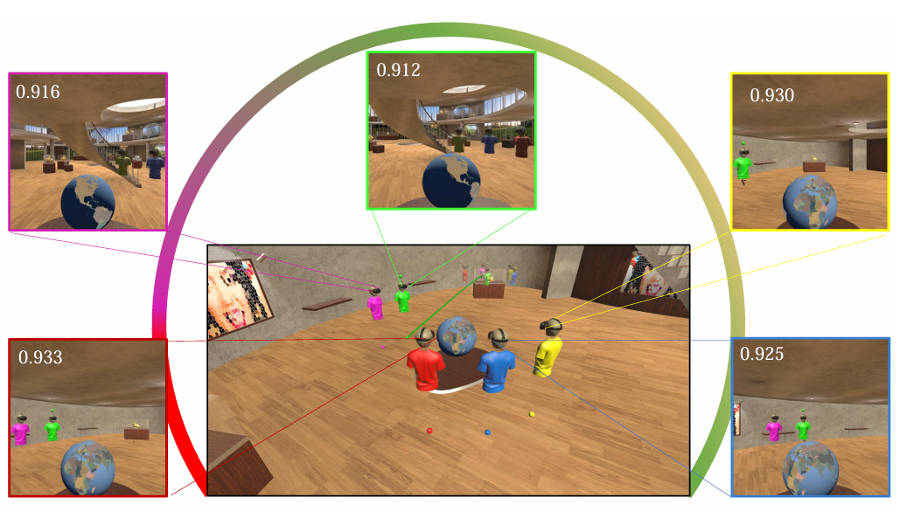{.pub-thumb}

::: {.pub-content}
### Automatic Formation Generation based on Scene Awareness for Guided Group Navigation in VR {.pub-title}

**Jian Wu**, Lili Wang\*, Zhikai Wen, Yanzhou Chen, Qianwen Wang, Bin Hu, Xuehuai Shi, Xiaolong Liu.

*IEEE Transactions on Visualization and Computer Graphics (IEEE TVCG)*.

[PDF](assets/papers/automatic-formation-generation-scene-awareness.pdf){.pub-btn target="_blank"}
[Video](https://www.youtube.com/watch?v=ReVDdWYxNqQ){.pub-btn target="_blank"}
:::
:::

::: {.pub-card}
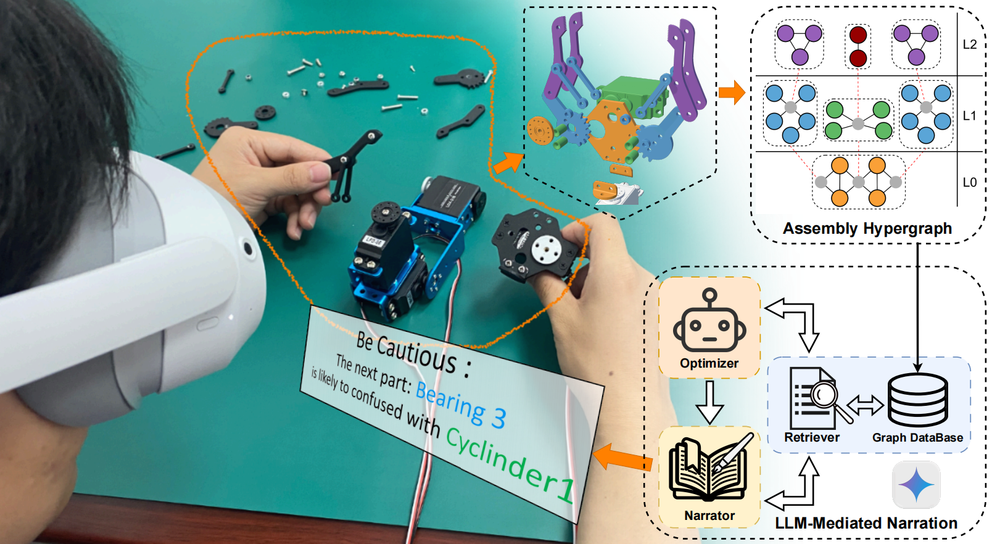{.pub-thumb}

::: {.pub-content}
### From Structure to Semantics: Hypergraph-Based AR Assembly Guidance with LLM-Mediated Narration {.pub-title}

Xinda Liu, Bowei Zhang, Jiaju Xu, Jian Wu\*, Guohua Geng, Lili Wang.

*IEEE Transactions on Visualization and Computer Graphics (IEEE TVCG)*  
*Also presented at IEEE Conference Virtual Reality and 3D User Interfaces (IEEE VR)*

[PDF](assets/papers/from-structure-to-semantics-hypergraph-based-ar-assembly-guidance.pdf){.pub-btn target="_blank"}
[Video](https://www.youtube.com/watch?v=apRfZh9oP3Y){.pub-btn target="_blank"}
:::
:::

::: {.pub-card}
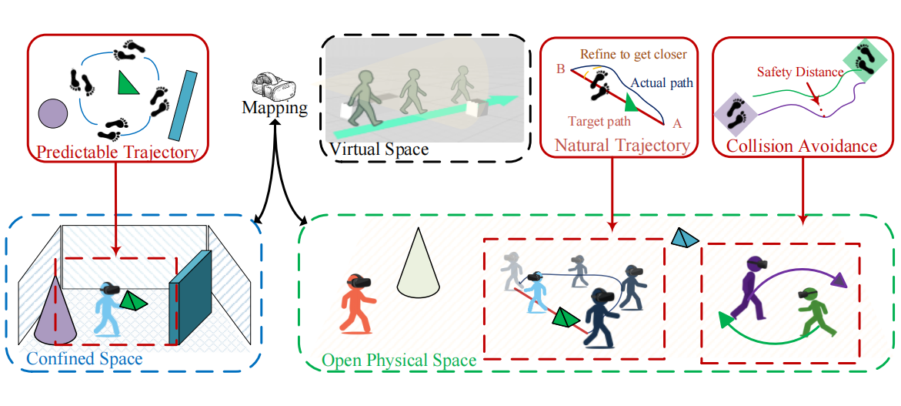{.pub-thumb}

::: {.pub-content}
### Walking in the Wild: Safe and Natural Redirected Walking in Open Physical Spaces {.pub-title}

Xinda Liu, Qinyu Zhang, Guoqiang Yang, Yunchen Li, Jian Wu\*, Guohua Geng, Lili Wang.

*IEEE Conference Virtual Reality and 3D User Interfaces (IEEE VR)*

[PDF](assets/papers/walking-in-the-wild-safe-and-natural-redirected-walking.pdf){.pub-btn target="_blank"}
[Video](https://www.youtube.com/watch?v=GlWVQ0lHTF4){.pub-btn target="_blank"}
:::
:::

::: {.pub-card}
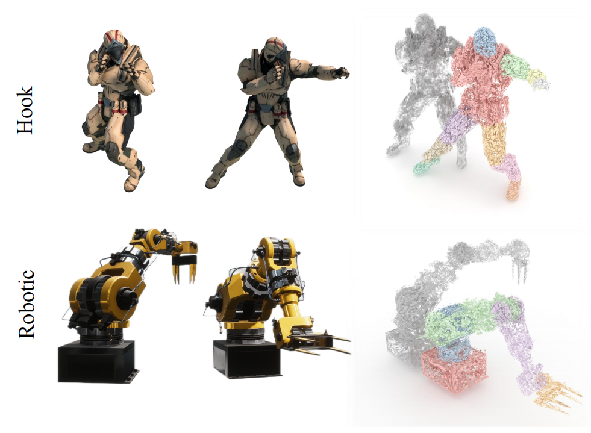{.pub-thumb}

::: {.pub-content}
### Motion Hierarchical Gaussian for Dynamic Control in VR {.pub-title}

Runze Fan, **Jian Wu**, Qixiang Ma, Zhikai Wen, Lili Wang\*.

*IEEE Transactions on Visualization and Computer Graphics (IEEE TVCG)*  
*Also presented at IEEE Conference Virtual Reality and 3D User Interfaces (IEEE VR)*

[PDF](assets/papers/motion-hierarchical-gaussian.pdf){.pub-btn target="_blank"}
[Video](https://www.youtube.com/watch?v=spl_KeKvSqU){.pub-btn target="_blank"}
:::
:::

::: {.pub-card}
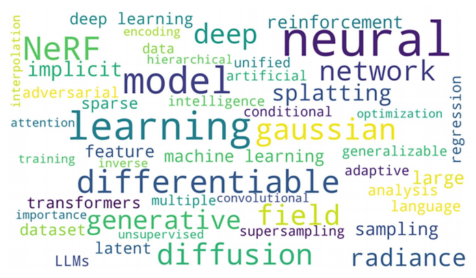{.pub-thumb}

::: {.pub-content}
### Artificial intelligence for virtual reality: a review {.pub-title}

Lili Wang, Weiwei Xu, Yebin Liu, Miao Wang, Beibei Wang, Xubo Yang, Lan Xu, Zhangyao Tan, Runze Fan, Zijun Wang, Chi Wang, Hongwen Zhang, Yijian Wen, Haozhong Yang, **Jian Wu\***, Jiahui Fan, Hui Wang, Qixuan Zhang, Guoping Wang, Yongtian Wang, Qinping Zhao.

*Science China Information Sciences*, 69(1), 1-64.

[PDF](assets/papers/artificial-intelligence-for-virtual-reality-review.pdf){.pub-btn target="_blank"}
<!-- [Video](assets/videos/artificial-intelligence-for-virtual-reality-review.mp4){.pub-btn target="_blank"} -->
:::
:::

## 2025 {.pub-year}

::: {.pub-card}
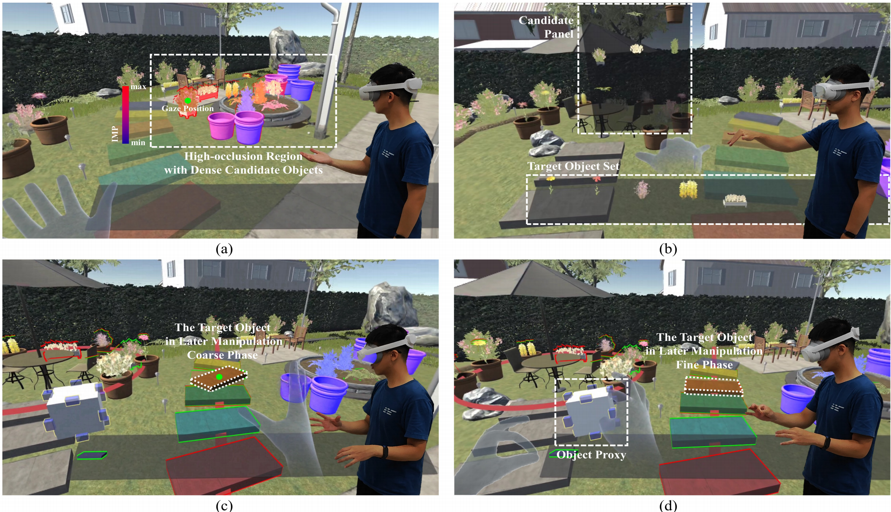{.pub-thumb}

::: {.pub-content}
### MOA: Efficient Scene-aware Multi-object Arrangement in VR {.pub-title}

Xuehuai Shi, Yuhan Duan, Ziteng Wang\*, **Jian Wu\***, Zhiwen Shao, Jieming Yin, Lili Wang.

*IEEE Transactions on Visualization and Computer Graphics (IEEE TVCG)*, 2025.

[PDF](assets/papers/2025-moa-efficient-scene-aware-multi-object-arrangement.pdf){.pub-btn target="_blank"}
[Video](https://xuehuai.net/publications/videos/2025-MOA.mp4){.pub-btn target="_blank"}
:::
:::

::: {.pub-card}
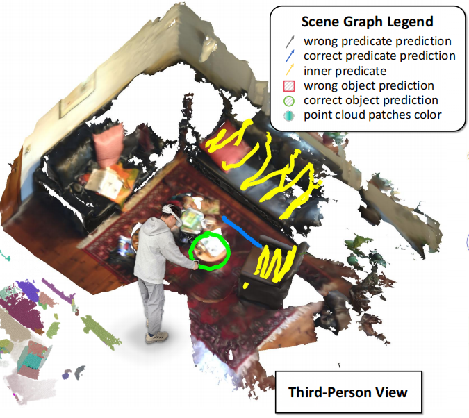{.pub-thumb}

::: {.pub-content}
### SGSG: Stroke-Guided Scene Graph Generation {.pub-title}

Qixiang Ma, Runze Fan, Lizhi Zhao, **Jian Wu**, Sio-Kei Im, Lili Wang\*.

*IEEE Transactions on Visualization and Computer Graphics (IEEE TVCG)*, 2025.  
*Also presented at IEEE ISMAR.*

[PDF](assets/papers/2025-sgsg-stroke-guided-scene-graph-generation.pdf){.pub-btn target="_blank"}
[Video](https://www.youtube.com/watch?v=FwlPHpO5yAk){.pub-btn target="_blank"}
:::
:::

::: {.pub-card}
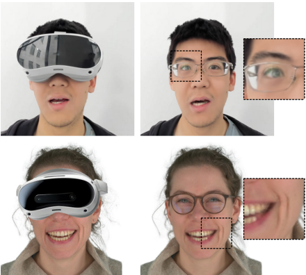{.pub-thumb}

::: {.pub-content}
### HFM-GS: half-face mapping 3DGS avatar based real-time HMD removal {.pub-title}

Kangyu Wang, **Jian Wu**, Runze Fan, Hongwen Zhang, Sio Kei Im, Lili Wang\*.

*IEEE Transactions on Visualization and Computer Graphics (IEEE TVCG)*.  
*Also presented at IEEE ISMAR.*

[PDF](assets/papers/hfm-gs-half-face-mapping-3dgs-avatar.pdf){.pub-btn target="_blank"}
[Video](https://www.youtube.com/watch?v=jweiTyQgB0g){.pub-btn target="_blank"}
:::
:::

::: {.pub-card}
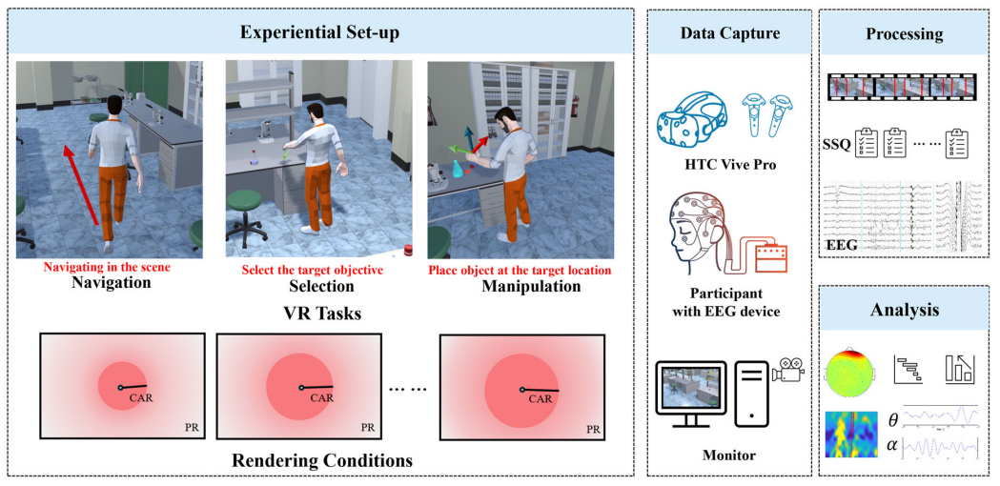{.pub-thumb}

::: {.pub-content}
### Cybersickness Exploration for Different VR Tasks Under Variable Rendering Conditions {.pub-title}

Peike Wang, Ming Li, **Jian Wu**, Lili Wang\*, Yong-Jin Liu.

*International Journal of Human-Computer Interaction (IJHCI)*.

[PDF](assets/papers/cybersickness-exploration-vr-tasks.pdf){.pub-btn target="_blank"}
[Video](https://www.youtube.com/watch?v=TWW5GRAaCro){.pub-btn target="_blank"}
:::
:::

::: {.pub-card}
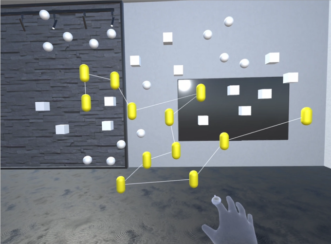{.pub-thumb}

::: {.pub-content}
### HandBrush for Efficient Object Grouping in Virtual Environment with Bare-Hand {.pub-title}

Sichun Huang, **Jian Wu**, Runze Fan, Sio Kei Im, Lili Wang\*.

*International Journal of Human-Computer Interaction (IJHCI)*, 41(15), 9797-9821.

[PDF](assets/papers/handbrush-efficient-object-grouping.pdf){.pub-btn target="_blank"}
[Video](https://www.youtube.com/watch?v=A3HAprafbLs){.pub-btn target="_blank"}
:::
:::

::: {.pub-card}
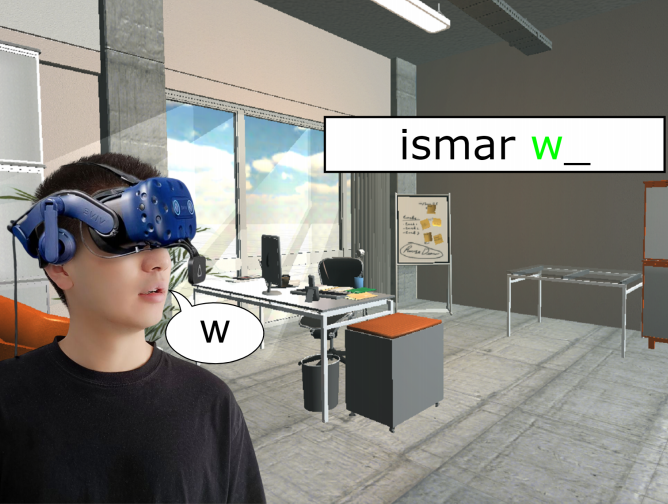{.pub-thumb}

::: {.pub-content}
### LipText: Lip Tracking Based Text Entry in VR {.pub-title}

Jiaye Leng, Zijun Wang, **Jian Wu\***, Lili Wang.

*International Conference on Extended Reality (ICXR)*, 162-178.

[PDF](assets/papers/liptext-lip-tracking-text-entry-vr.pdf){.pub-btn target="_blank"}
<!-- [Video](assets/videos/liptext-lip-tracking-text-entry-vr.mp4){.pub-btn target="_blank"} -->
:::
:::

::: {.pub-card}
{.pub-thumb}

::: {.pub-content}
### Audio-visual aware Foveated Rendering {.pub-title}

Xuehuai Shi, Yucheng Li, Jiaheng Li\*, **Jian Wu**, Jieming Yin\*, Xiaobai Chen, Lili Wang.

*IEEE Transactions on Visualization and Computer Graphics (IEEE TVCG)*.

[PDF](assets/papers/audio-visual-aware-foveated-rendering.pdf){.pub-btn target="_blank"}
[Video](https://www.youtube.com/watch?v=1vpZYQDbQTk){.pub-btn target="_blank"}
:::
:::

::: {.pub-card}
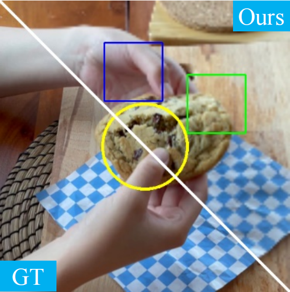{.pub-thumb}

::: {.pub-content}
### Fov-GS: Foveated 3D Gaussian Splatting for Dynamic Scenes {.pub-title}

Runze Fan, **Jian Wu**, Xuehuai Shi, Lizhi Zhao, Qixiang Ma, Lili Wang\*.

*IEEE Transactions on Visualization and Computer Graphics (IEEE TVCG)*, 31(5), 2975-2985.  
*Also presented at IEEE VR. VR 2025 Best Paper Honorable Mention.*

[PDF](assets/papers/2025-fov-gs-foveated-3d-gaussian-splatting.pdf){.pub-btn target="_blank"}
[Video](https://www.youtube.com/watch?v=IAR6PekgMBc){.pub-btn target="_blank"}
:::
:::

::: {.pub-card}
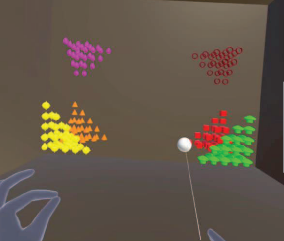{.pub-thumb}

::: {.pub-content}
### PwP: Permutating with Probability for Efficient Group Selection in VR {.pub-title}

**Jian Wu**, Weicheng Zhang, Handong Chen, Wei Lin, Xuehuai Shi, Lili Wang\*.

*IEEE Transactions on Visualization and Computer Graphics (IEEE TVCG)*, 31(5), 2384-2394.  
*Also presented at IEEE VR.*

[PDF](assets/papers/2025-pwp-permutating-with-probability.pdf){.pub-btn target="_blank"}
[Video](https://www.youtube.com/watch?v=3zL_ZFrutJM){.pub-btn target="_blank"}
:::
:::

## 2024 {.pub-year}

::: {.pub-card}
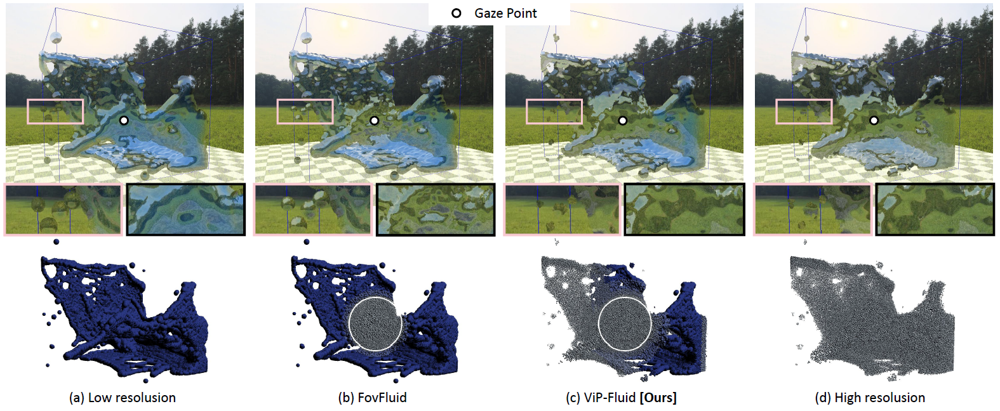{.pub-thumb}

::: {.pub-content}
### ViP-Fluid: Visual Perception Driven Method for VR Fluid Rendering {.pub-title}

Qixiang Ma, **Jian Wu**\*, Runze Fan, Guodong Sun, Xuehuai Shi.

*2024 IEEE International Symposium on Mixed and Augmented Reality (ISMAR)*, Bellevue, WA, USA, 2024, pp. 359-367.

[PDF](assets/papers/Vip-Fluid.pdf){.pub-btn target="_blank"}
<!-- [Video](assets/videos/Vip-Fluid.mp4){.pub-btn target="_blank"} -->
:::
:::

::: {.pub-card}
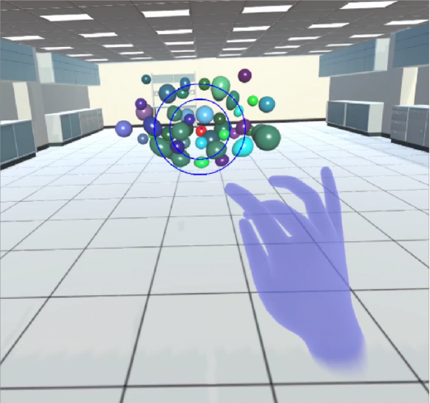{.pub-thumb}

::: {.pub-content}
### Manipulable Cone Based Bare Hand Object Selection in High Occlusion Virtual Environment {.pub-title}

Jiaqi Zhou, **Jian Wu**, Sio Kei Im, Runze Fan, Lili Wang\*.

*International Journal of Human-Computer Studies (IJHCS)*, 196, 103432.

[PDF](assets/papers/manipulable-cone-bare-hand-selection.pdf){.pub-btn target="_blank"}
[Video](https://www.youtube.com/watch?v=GXkNQJ_iYIQ){.pub-btn target="_blank"}
:::
:::

::: {.pub-card}
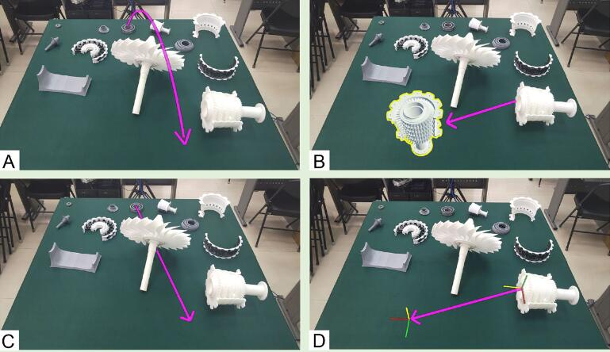{.pub-thumb}

::: {.pub-content}
### AVICol: Adaptive Visual Instruction for Remote Collaboration Using Mixed Reality {.pub-title}

Lili Wang\*, Xiangyu Li, **Jian Wu**, Dong Zhou, Im Sio Kei, Voicu Popescu.

*International Journal of Human-Computer Interaction (IJHCI)*, 41(2), 1260-1279.

[PDF](assets/papers/avicol-adaptive-visual-instruction.pdf){.pub-btn target="_blank"}
<!-- [Video](assets/videos/avicol-adaptive-visual-instruction.mp4){.pub-btn target="_blank"} -->
:::
:::

::: {.pub-card}
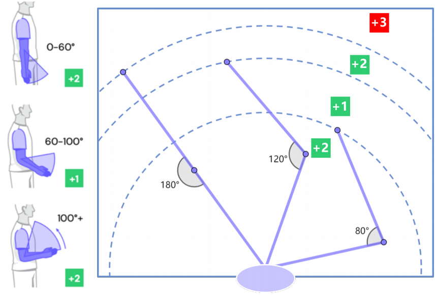{.pub-thumb}

::: {.pub-content}
### Efficient and Comfortable Haptic Retargeting with Reset Point Optimization {.pub-title}

Aoxin Sun, **Jian Wu**, Runze Fan, Sio Kei Im, Lili Wang\*.

*IEEE Transactions on Visualization and Computer Graphics (IEEE TVCG)*.

[PDF](assets/papers/efficient-comfortable-haptic-retargeting-reset-point.pdf){.pub-btn target="_blank"}
[Video](https://www.youtube.com/watch?v=fL1W8CO2Bw0){.pub-btn target="_blank"}
:::
:::

::: {.pub-card}
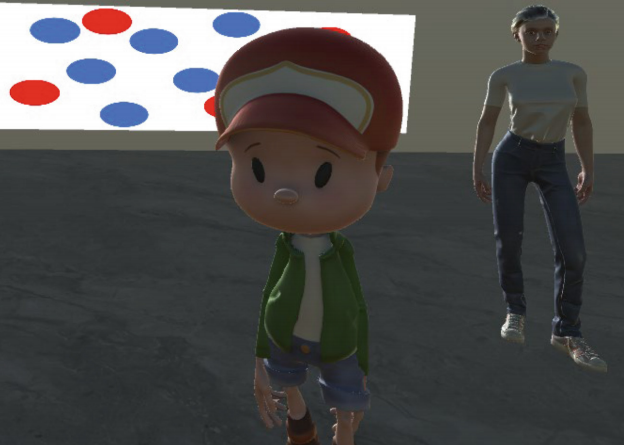{.pub-thumb}

::: {.pub-content}
### Where Should a Virtual Guide Stand in a VR Museum? {.pub-title}

Xinda Liu\*, Kun Jiang, **Jian Wu**, Lili Wang, Guohua Geng.

*International Conference on Extended Reality (ICXR)*, 312-328.

[PDF](assets/papers/where-should-a-virtual-guide-stand.pdf){.pub-btn target="_blank"}
<!-- [Video](assets/videos/where-should-a-virtual-guide-stand.mp4){.pub-btn target="_blank"} -->
:::
:::

::: {.pub-card}
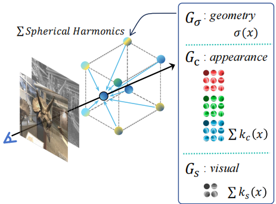{.pub-thumb}

::: {.pub-content}
### VPRF: Visual Perceptual Radiance Fields for Foveated Image Synthesis {.pub-title}

Zijun Wang, **Jian Wu**, Runze Fan, Wei Ke, Lili Wang\*.

*IEEE Transactions on Visualization and Computer Graphics (IEEE TVCG)*, 30(11), 7183-7192.  
*Also presented at IEEE ISMAR. ISMAR 2024 Best Student Journal Paper.*

[PDF](assets/papers/vprf-visual-perceptual-radiance-fields.pdf){.pub-btn target="_blank"}
[Video](https://www.youtube.com/watch?v=FCmrWd3J6Yo){.pub-btn target="_blank"}
:::
:::

::: {.pub-card}
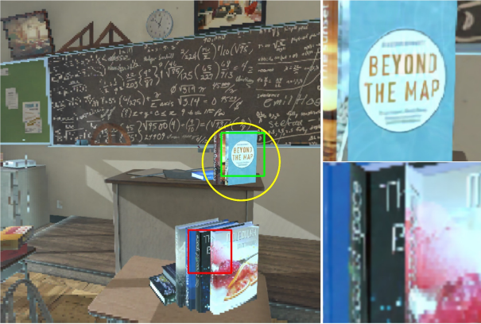{.pub-thumb}

::: {.pub-content}
### Scene-aware Foveated Neural Radiance Fields {.pub-title}

Xuehuai Shi, Lili Wang\*, Xinda Liu, **Jian Wu**, Zhiwen Shao.

*IEEE Transactions on Visualization and Computer Graphics (IEEE TVCG)*.

[PDF](assets/papers/scene-aware-foveated-neural-radiance-fields.pdf){.pub-btn target="_blank"}
[Video](https://www.youtube.com/watch?v=KkneIYnnyaM){.pub-btn target="_blank"}
:::
:::

::: {.pub-card}
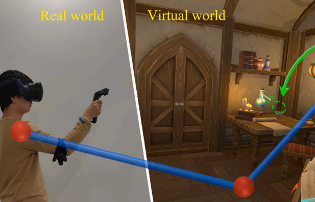{.pub-thumb}

::: {.pub-content}
### EEBA: Efficient and ergonomic Big-Arm for distant object manipulation in VR {.pub-title}

**Jian Wu**, Lili Wang\*, Sio Kei Im, Chan Tong Lam.

*International Journal of Human-Computer Studies (IJHCS)*, 188, 103273.

[PDF](assets/papers/eeba-efficient-ergonomic-big-arm.pdf){.pub-btn target="_blank"}
[Video](https://www.youtube.com/watch?v=nAHYZ_iyfu0){.pub-btn target="_blank"}
:::
:::

::: {.pub-card}
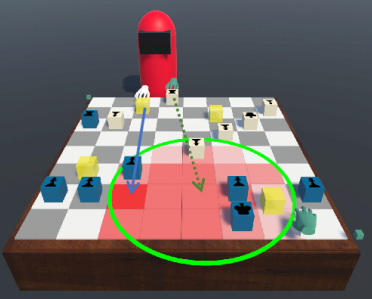{.pub-thumb}

::: {.pub-content}
### Proxy Importance Based Haptic Retargeting With Multiple Props in VR {.pub-title}

Ziming Liu, **Jian Wu**, Lili Wang\*, Xiangyu Li, Sio Kei Im.

*IEEE Transactions on Visualization and Computer Graphics (IEEE TVCG)*.

[PDF](assets/papers/proxy-importance-haptic-retargeting-multiple-props.pdf){.pub-btn target="_blank"}
[Video](https://www.youtube.com/watch?v=w_D86z_oCKc){.pub-btn target="_blank"}
:::
:::

::: {.pub-card}
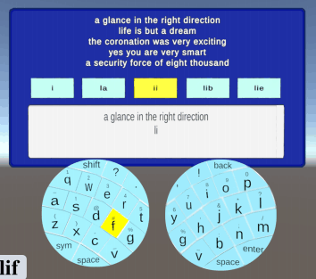{.pub-thumb}

::: {.pub-content}
### FanPad: A Fan Layout Touchpad Keyboard for Text Entry in VR {.pub-title}

**Jian Wu**, Ziteng Wang, Lili Wang\*, Yuhan Duan, Jiaheng Li.

*IEEE Conference on Virtual Reality and 3D User Interfaces (IEEE VR)*, 222-232.

[PDF](assets/papers/fanpad-fan-layout-touchpad-keyboard.pdf){.pub-btn target="_blank"}
[Video](https://www.youtube.com/watch?v=sPNiz5diP_0){.pub-btn target="_blank"}
:::
:::

::: {.pub-card}
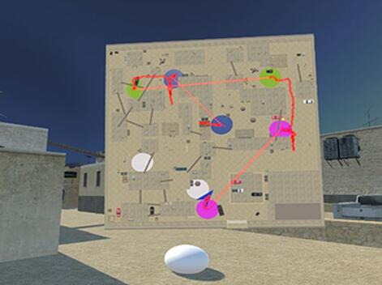{.pub-thumb}

::: {.pub-content}
### Automatic portals layout for VR navigation {.pub-title}

Xiaolong Liu, Lili Wang\*, Yi Liu, **Jian Wu**.

*Virtual Reality*, 28(1), 9.

[PDF](assets/papers/automatic-portals-layout-vr-navigation.pdf){.pub-btn target="_blank"}
[Video](https://www.youtube.com/watch?v=KA40RAXrhAE){.pub-btn target="_blank"}
:::
:::

::: {.pub-card}
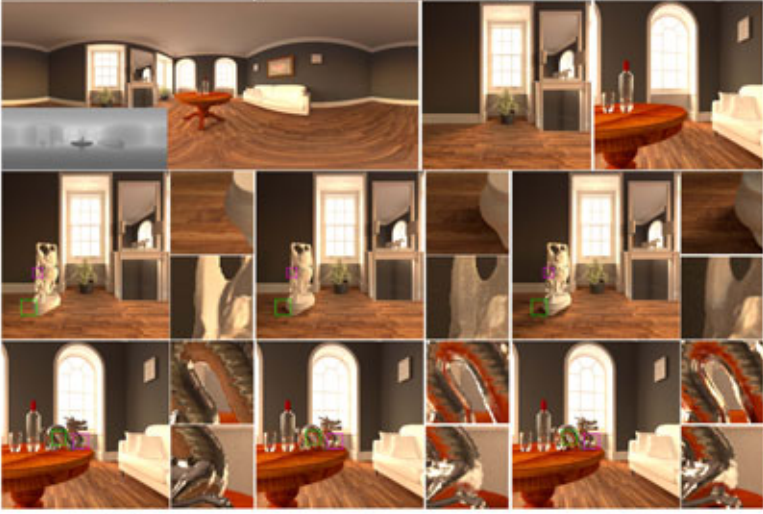{.pub-thumb}

::: {.pub-content}
### Panoramic Ray Tracing for Interactive Mixed Reality Rendering Based on 360 RGBD Video {.pub-title}

**Jian Wu**, Lili Wang\*.

*IEEE Computer Graphics and Applications (IEEE CG&A)*.

[PDF](assets/papers/panoramic-ray-tracing-interactive-mr.pdf){.pub-btn target="_blank"}
[Video](https://www.youtube.com/watch?v=FXpiFuKbviY){.pub-btn target="_blank"}
:::
:::

## Before 2024 {.pub-year}

::: {.pub-card}
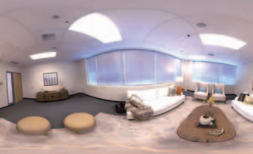{.pub-thumb}

::: {.pub-content}
### Interactive Panoramic Ray Tracing for Mixed 360 RGBD Videos {.pub-title}

**Jian Wu**, Lili Wang\*, Wei Ke.

*IEEE VRW*, 777-778.

[PDF](assets/papers/interactive-panoramic-ray-tracing-mixed-rgbd.pdf){.pub-btn target="_blank"}
[Video](https://youtu.be/PB6CJq_VAXA){.pub-btn target="_blank"}
:::
:::

::: {.pub-card}
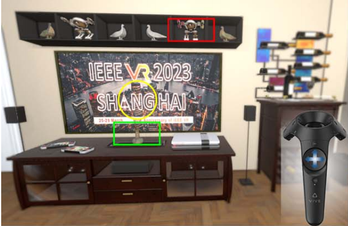{.pub-thumb}

::: {.pub-content}
### Locomotion-aware Foveated Rendering {.pub-title}

Xuehuai Shi, Lili Wang\*, **Jian Wu**, Wei Ke, Chan-Tong Lam.

*IEEE VR*, 471-481.

[PDF](assets/papers/locomotion-aware-foveated-rendering.pdf){.pub-btn target="_blank"}
[Video](https://www.youtube.com/watch?v=GIQFfQ5wN4E){.pub-btn target="_blank"}
:::
:::

::: {.pub-card}
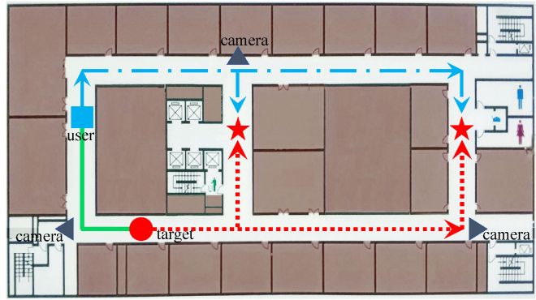{.pub-thumb}

::: {.pub-content}
### AR assistance for efficient dynamic target search {.pub-title}

Zixiang Zhao, **Jian Wu**, Lili Wang\*.

*Computational Visual Media (CVM)*, 9(1), 177-194.

[PDF](assets/papers/ar-assistance-efficient-dynamic-target-search.pdf){.pub-btn target="_blank"}
[Video](https://www.youtube.com/watch?v=14aiBVsO3B8){.pub-btn target="_blank"}
:::
:::

::: {.pub-card}
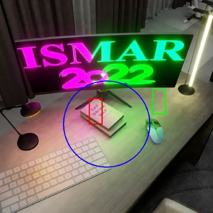{.pub-thumb}

::: {.pub-content}
### Foveated Stochastic Lightcuts {.pub-title}

Xuehuai Shi, Lili Wang\*, **Jian Wu**, Aimin Hao. 2022.

*IEEE Transactions on Visualization and Computer Graphics*, 28(11), 3684-3693.

[PDF](assets/papers/2022-foveated-stochastic-lightcuts.pdf){.pub-btn target="_blank"}
[Video](https://www.youtube.com/watch?v=N6Rvfjo_oU4){.pub-btn target="_blank"}
:::
:::

::: {.pub-card}
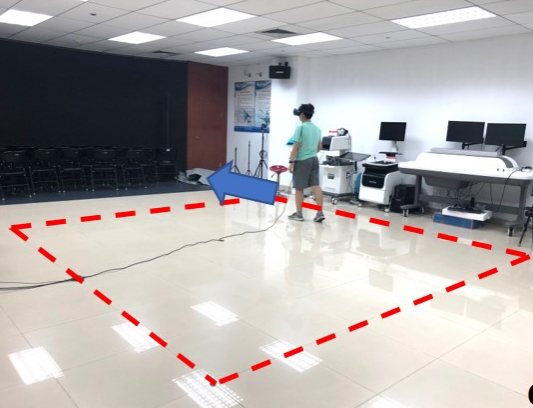{.pub-thumb}

::: {.pub-content}
### Automatic Virtual Portals Placement for Efficient VR Navigation {.pub-title}

Lili Wang\*, Yi Liu, Xiaolong Liu, **Jian Wu**. 2021.

*IEEE VR 2021 Poster*, 628-629.

[PDF](assets/papers/2021-automatic-virtual-portals-placement.pdf){.pub-btn target="_blank"}
<!-- [Video](assets/videos/2021-automatic-virtual-portals-placement.mp4){.pub-btn target="_blank"} -->
:::
:::

::: {.pub-card}
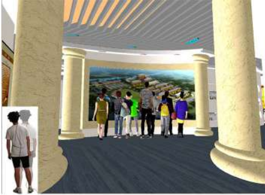{.pub-thumb}

::: {.pub-content}
### Quantifiable Fine-Grain Occlusion Removal Assistance for Efficient VR Exploration {.pub-title}

**Jian Wu**, Lili Wang\*, Hui Zhang, Voicu Popescu. 2022.

*IEEE Transactions on Visualization and Computer Graphics*, 28(9), 3154-3167.

[PDF](assets/papers/2022-quantifiable-fine-grain-occlusion-removal.pdf){.pub-btn target="_blank"}
<!-- [Video](assets/videos/2022-quantifiable-fine-grain-occlusion-removal.mp4){.pub-btn target="_blank"} -->
:::
:::

::: {.pub-card}
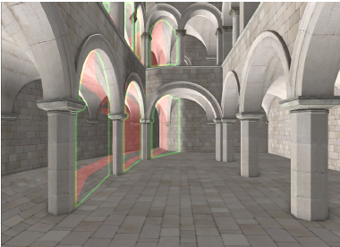{.pub-thumb}

::: {.pub-content}
### VR Exploration Assistance through Automatic Occlusion Removal {.pub-title}

Lili Wang\*, **Jian Wu**, Xuefeng Yang, Voicu Popescu. 2019.

*IEEE Transactions on Visualization and Computer Graphics*, 25(5), 2083-2092.  
*Also presented at IEEE VR 2019.*

[PDF](assets/papers/2019-vr-exploration-assistance-occlusion-removal.pdf){.pub-btn target="_blank"}
<!-- [Video](assets/videos/2019-vr-exploration-assistance-occlusion-removal.mp4){.pub-btn target="_blank"} -->
:::
:::

::: {.pub-card}
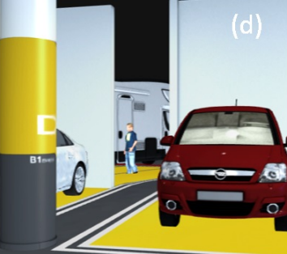{.pub-thumb}

::: {.pub-content}
### Occlusion management in VR: A comparative study {.pub-title}

Lili Wang\*, Han Zhao, Zesheng Wang, **Jian Wu**, Bingqiang Li, Zhiming He, Voicu Popescu. 2019.

*IEEE VR 2019*, 708-716.

[PDF](assets/papers/2019-occlusion-management-comparative-study.pdf){.pub-btn target="_blank"}
<!-- [Video](assets/videos/2019-occlusion-management-comparative-study.mp4){.pub-btn target="_blank"} -->
:::
:::

